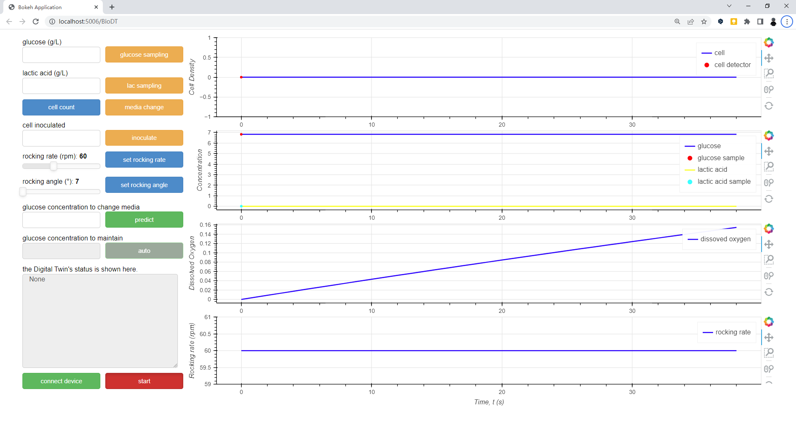

# BioDT
An integrated Digital-Twin-based framework for intelligent bio-manufacturing. 



# Usage
1. Several Python packages is requried, including bokeh, Scipy, SQLite3, etc. For the sake of simplicity, we recommand to deal with the dependencies, which can be download from https://www.anaconda.com
2. Download the code
```shell
git clone https://github.com/BeichenZhao/BioDT.git
```
3. run the bokeh script to start the application
```shell
bokeh serve --show BioDT
```
4. Then the default browser would be opened automately to show the frontend
